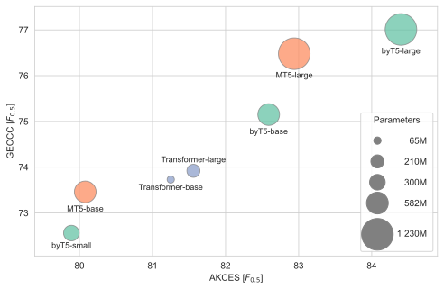

# Refining Czech GEC: Insights from a Multi-Experiment Approach

This repository contains the source code accompanying the following paper:

---

<h3 align="center"><a href="https://arxiv.org/pdf/2506.22402">Refining Czech GEC: Insights from a Multi-Experiment Approach</a></h3>

  <b>Petr Pechman, Milan Straka, Jana Straková, Jakub Náplava</b> 
  Seznam.cz, Prague, Czech Republic 
  Charles University, Prague, Czech Republic

**Abstract:**  We present a grammar error correction (GEC) system that achieves
state of the art for the Czech language. Our system is based on a neural network
translation approach with the Transformer architecture, and its key feature is
its real-time synthetic generation pipeline, which dynamically augments
sentences with artificial errors by introducing both language-agnostic and
Czech-specific errors. We conduct a comprehensive series of experiments,
investigating the Czech GEC corpora as bases for synthetic error introduction,
several error generation strategies, domain balancing, tokenization granularity,
model size, and data scaling during fine-tuning. Additionally, we evaluate the
performance of large language models (LLMs) on Czech GEC in both end-user and
expert fine-tuning scenarios. Our best-performing model is superior both in
performance and computational efficiency. The source code and the trained model
links are available on https://github.com/ufal/tsd2025-gec.  

---

We release finetuned models, available on HuggingFace:

- [**byt5-large-geccc-mate**](https://huggingface.co/ufal/byt5-large-geccc-mate)
- [**byt5-large-akces-mate**](https://huggingface.co/ufal/byt5-large-akces-mate)
- [**byt5-base-geccc-mate**](https://huggingface.co/ufal/byt5-base-geccc-mate)
- [**byt5-small-geccc-mate**](https://huggingface.co/ufal/byt5-small-geccc-mate)
- [**transformer-base-geccc-mate**](https://huggingface.co/ufal/transformer-base-geccc-mate)

---

For usage instructions and examples, please refer to [Guide](./guide.md).
